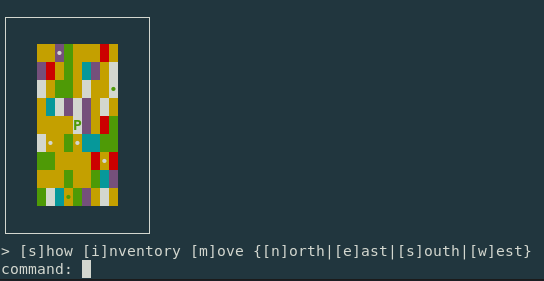
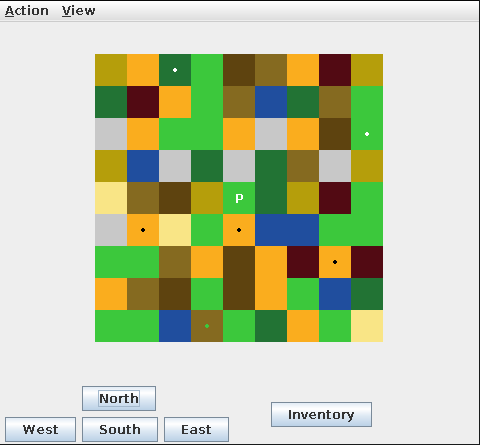

# swingy

**swingy** is a small text RPG where you can create a hero and fight monsters in an endless world.

The game is simple, a new map is generated when you die or when you exit the previous map, random enemies appear on the map.  
When you kill an enemy you gain experience and levels, which give you more stats depending on your class, and they can drop artefacts which also give you stats.

There is two views as per the requirement of the subject, a console view (by default) and another ugly view using **Swing** (hence the name).  
By default the console view will be used, but you can use the other view by entering ``set-display gui``, or adding the ``gui`` parameter on launch.

<table>
  <tr>
    <td></td>
    <td></td>
  </tr>
</table>

## Usage

[Maven](https://maven.apache.org/) and Java 17 is required.

```bash
mvn package
java -jar target/swingy-1.0-jar-with-dependencies.jar
```

```bash
# All arguments are optional
usage: swingy
    -d,--display <arg>    display mode
    -h,--host <arg>       host of the database
    -n,--name <arg>       name of the database
    -p,--port <arg>       port of the database
    -q,--password <arg>   password of the database
    -u,--user <arg>       user of the database
```

All save files are saved in the ``/saves`` folder, but you can also enable saving your heroes in a database, **Docker compose** is required:

```bash
cp database/.env.example database/.env
docker compose up
```

Will open a Postgres database on port 5442, and an [adminer](https://www.adminer.org/) view on port 5050 to see your database.  
To connect to the database you can set the credentials in the ``/database/.env`` file, or use the default one: ``database:admin/admin@swingy``.

Saving the heroes in a database is slower and not recommended.
